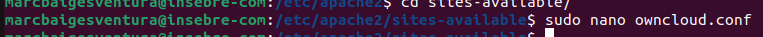
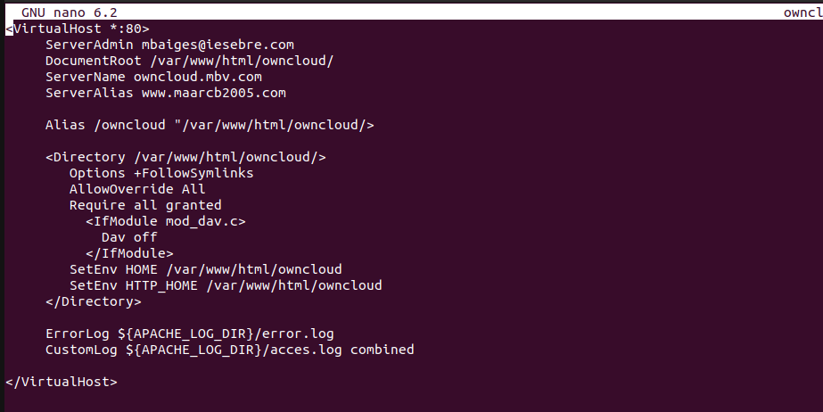

# COM INSTAL·LAR OWNCLOUD PER COMANDES

Primera comanda sira per instal·lar l'apache

## Instal·lar MariaDB
Una vegada tenim instal·lat el apache instal·larem la base de dades MariDB

Seguidament posarem aquesta comanda

Ara rainiciarem la base de dades per generar els canvis

Ara posem esta comanda que ens permet tenir tots els permisos

I podrem entrar a la linea de comandes de MariaDB

## Instal·lació PHP

Instalarem el software necessari

Primer instal·larem els repositoris

Ara si que ja podrem instalar PHP amb la versió corresponent

Ara tindrem que editar el PHP per aixo posarem lacomanda nano

Lo que tindrem que editar es =

* File_uploads
* On allow_url_fopen
* On memory_limit = 256M upload_max_filesize
* 100M display_errors = Off
* Date.timezone = Europe/Madrid

Quan ja ho tindrem editat ctrl+o per guardar i cntrl+x per sortir
 
## Intal·lació Owncloud

Ara mourem a la carpeta corresponent

Seguidament cambiarem el propietari del arxiu

